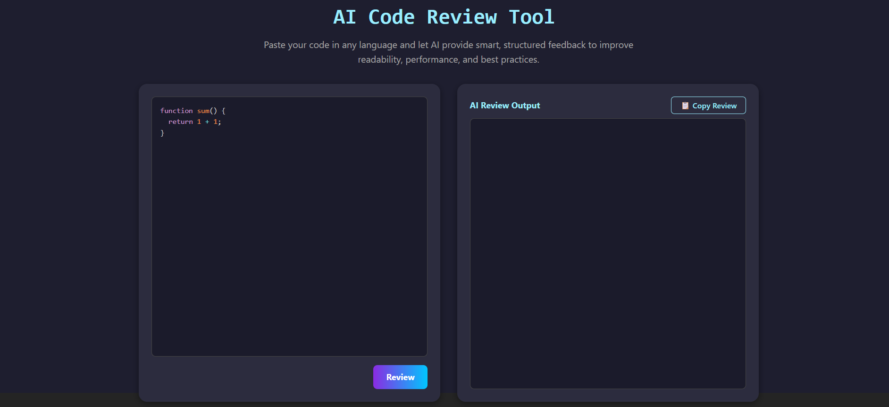

# 🧠 AI-Powered Code Reviewer

A modern, responsive MERN-based web application that allows users to input source code and receive intelligent feedback using Google’s Gemini AI. Designed with a sleek dark theme and typing animations.

---

## 🚀 Features

- ✅ Review Code(C++, Java, Javascript and Python etc.) with Gemini AI
- ✅ Instant AI-powered feedback with actionable suggestions
- ✅ Markdown-formatted output with syntax highlighting
- ✅ Copy-to-clipboard functionality
- ✅ Animated typing header
- ✅ Modular frontend and backend structure

---

## 🖥️ Tech Stack

| Layer       | Tech Used                            |
|------------|----------------------------------------|
| Frontend    | React, PrismJS, React Markdown, Axios |
| Backend     | Node.js, Express.js                   |
| AI Engine   | Gemini Pro (via API key)              |
| Styling     | CSS (dark theme, custom animations)   |

---

## 📸 Demo Screenshot



---

## 🔧 Installation

### 1. Clone the Repository

```bash
git clone https://github.com/your-username/ai-code-reviewer.git
cd ai-code-reviewer
